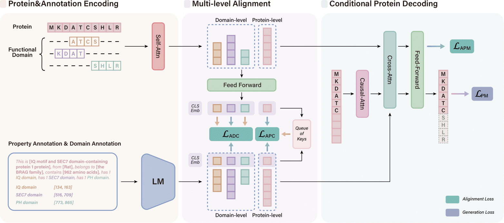

<h1 align="center"> Annotation-guided Protein Design with Multi-Level Domain Alignment (KDD 2025) </a></h2>

This is the official implementation of the paper:
> Annotation-guided Protein Design with Multi-Level Domain Alignment
>
> Chaohao Yuan, Songyou Li, Geyan Ye<sup>#</sup>, Yikun Zhang, Long-Kai Huang, Wenbing Huang, Wei Liu, Jianhua Yao, Yu Rong<sup>*</sup>
>
> <sup>#</sup> Project Lead, <sup>*</sup> Corresponding Author.


<p align="center"></p>
<p align="center"><em>The framework of PAAG.</em></p>


- [Paper](https://arxiv.org/abs/2404.16866)
- [Project Page](https://ychaohao.github.io/PAAG/)
- [Datasets on HuggingFace](https://huggingface.co/datasets/ychaohao/ProtAnnotation)
- [Checkpoints on Huggingface](https://huggingface.co/ychaohao/PAAG)


# Requirement

- Python 3.8
- The implementation is based on pytorch and pytorch-lightning. Please refer to the `requirements.txt` for detailed information.

# Mode & Data Preparation

We provide the ProtAnnotation Dataset in [Huggingface](https://huggingface.co/datasets/ychaohao/ProtAnnotation). Please download the dataset and move it under `./data` folder.

`python model_download.py` will help to fetch the pretrained SciBert and ProtBert from Huggingface. We store the checkpoint to the future alignment.

# Pretaining

`python pretrain_pl.py --config './configs/pretrain_full_dataset.yaml'` Please modify the number of GPUs and machines to accommodate your own GPU environments. Pytorch-lightning allows multi-GPU training by DDP.

# Downstream Task

`python pretrain_downstream_pl.py` The file is to design the protein with given prompts.

# Evaluation

Coming soon!

# Reference

Please kindly cite our paper if you find this paper and the codes helpful. :)

```
@misc{yuan2024annotationguidedproteindesignmultilevel,
      title={Annotation-guided Protein Design with Multi-Level Domain Alignment}, 
      author={Chaohao Yuan and Songyou Li and Geyan Ye and Yikun Zhang and Long-Kai Huang and Wenbing Huang and Wei Liu and Jianhua Yao and Yu Rong},
      year={2024},
      eprint={2404.16866},
      archivePrefix={arXiv},
      primaryClass={q-bio.QM},
      url={https://arxiv.org/abs/2404.16866}, 
}
```
